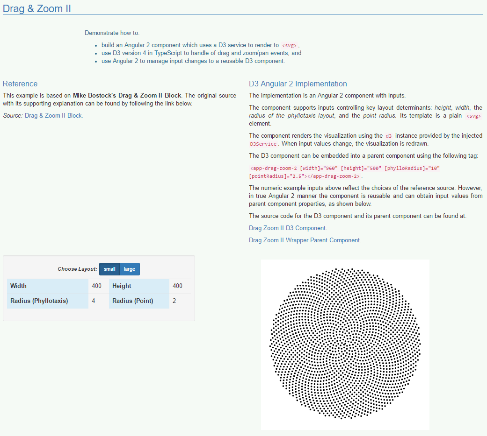

# Reusable Visual Power?

## Fuse D3 and Angular 2 in TypeScript (A Demo)

Ever wondered, how to build modern web apps with reusable, interactive data visualization components?

The latest incarnation of **[D3](https://d3js.org/)** is getting you excited about new destinations. **[Angular 2](https://angular.io/)** is finally on the tarmac. [**TypeScript**](https://github.com/midrosoft/typescript) has become the fuel that lets you develop complex solutions at scale.

Integrating all three, however, seems as daunting as taking off in the perfect storm.

This Angular 2 demo app is intended to get you started. Rather than trying to be exhaustive or writing a lengthy blog post, a select few well-known D3 demo scripts have been adapted to highlight key considerations:

* use an Angular 2 Service to inject the power of D3 version 4 into a project,

* explore how D3 visualizations can be implemented as Angular 2 components in TypeScript 2,

* see how a visualization component can change in response to input data changes,

* find ways to unit test your D3 components with Karma/Jasmine, and

* check out an example end-to-end test using Protractor.

_The running web app can be seen at:_ **[d3-ng2-demo Github Page](https://tomwanzek.github.io/d3-ng2-demo/)**.

## Explore this Project Locally

This project was generated with **[angular-cli](https://github.com/angular/angular-cli) version 1.0.0-beta.21**.

### Installation

In order to explore the project locally:

1. clone this git repository using `git clone https://github.com/tomwanzek/d3-ng2-demo.git`,
2. change into the project directory `cd d3-ng2-demo`, and
3. run `npm install`.

Now you are ready to explore the source code and use the features provided by **angular-cli** for your convenience.
A brief overview of the command line support provided by angular-cli is sketched out in the following subsections.

### Development Server
Run `ng serve` for a dev server. Navigate to `http://localhost:4200/`. The app will automatically reload if you change any of the source files.

### Code scaffolding

Run `ng generate component component-name` to generate a new component. You can also use `ng generate directive/pipe/service/class`.

### Build

Run `ng build` to build the project. The build artifacts will be stored in the `dist/` directory. Use the `-prod` flag for a production build.

### Running Unit Tests

Run `ng test` to execute the unit tests via [Karma](https://karma-runner.github.io).

### Running End-to-End Tests

Run `ng e2e` to execute the end-to-end tests via [Protractor](http://www.protractortest.org/). 
Before running the tests make sure you are serving the app via `ng serve`.

### Further Help

To get more help on the `angular-cli` use `ng --help` or go check out the [Angular-CLI README](https://github.com/angular/angular-cli/blob/master/README.md).
